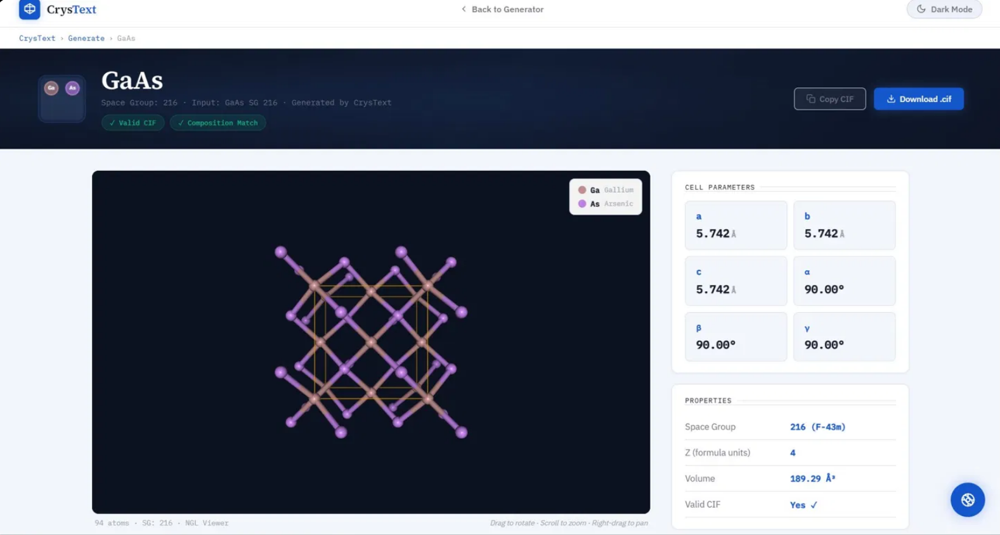

# CrysText — Text-Conditioned Crystal Structure Generation

Generate valid crystal structure CIF files from a material formula and space group number using a fine-tuned large language model.



---

## What It Does

Type a formula like `NaCl` and space group `225` — or describe it in natural language like *"generate a structure for NaCl with space group 225"* — and CrysText generates a complete Crystallographic Information File (CIF) with cell parameters, atom positions, and symmetry information, rendered as an interactive 3D ball-and-stick structure in a dedicated structure viewer page.

---

## Model

- **Base:** Mistral-7B-v0.3
- **Fine-tuning:** QLoRA (r=16, lora_alpha=16), 4-bit quantization
- **Dataset:** MP-20 (27,136 experimentally verified crystal structures)
- **Training:** Epoch 1 (full 27k) + Epoch 2 (shuffled 20k continuation)
- **Current Model:** https://huggingface.co/rakshitha9/crystext-mistral-10k

### Evaluation Results (Epoch 2 Model, n=10)

| Metric | Score |
|---|---|
| CIF Parse Rate | 100% |
| Composition Accuracy | 100% |
| Space Group Accuracy | 60% |
| Structure Match Rate | 40% |
| Train Loss | 0.1931 |
| Val Loss | 0.1992 |
| Test Loss | 0.1880 |

---

## Requirements

- Python 3.10+
- CUDA GPU with at least **8GB VRAM**
- CUDA drivers installed
- Gemini API key (free at [aistudio.google.com](https://aistudio.google.com))
- Groq API key (free at [console.groq.com](https://console.groq.com))

---

## Installation

```bash
git clone https://github.com/rakshitha-dev9/Crystext.git
cd Crystext
pip install -r requirements.txt
```

---

## API Keys Setup

Before running, add your API keys. For demo/local use only — never expose real API keys in frontend files in production. 
For local testing, add them directly:

**In `index.html`** (find these lines near the bottom):
```javascript
const GEMINI_API_KEY = 'YOUR_GEMINI_API_KEY';
const GROQ_API_KEY = 'YOUR_GROQ_API_KEY';
```

**In `structure.html`** (find these lines near the bottom):
```javascript
const GEMINI_API_KEY = 'YOUR_GEMINI_API_KEY';
const GROQ_API_KEY = 'YOUR_GROQ_API_KEY';
```

The chatbot uses **Groq (Llama 3.3 70B) as primary** and Gemini as fallback — so if Gemini is unavailable during demo, Groq takes over automatically.

---

## Running The App

You need two terminals open at the same time.

**Terminal 1 — Start the Flask backend:**
```bash
python app.py
```
Wait until you see:
```
CrysText is ready! Server starting on http://localhost:5000
```
This takes 5-10 minutes on first run (model downloading and loading).

**Terminal 2 — Start the frontend:**
```bash
python -m http.server 8080
```

**Then open your browser:**
```
http://localhost:8080/index.html
```

---

## How It Works

1. User enters formula + space group (structured mode) or describes it in natural language
2. Frontend sends to Flask backend → prompt refinement → model inference → CIF validation
3. Result appears in the right panel with validation badges and CIF preview
4. Click **Visualize 3D Structure** → structure page opens instantly from cache (no re-generation)
5. Structure page shows 3D viewer, cell parameters, properties, compound info via AI

---

## Good Demo Compounds

| Formula | Space Group | Structure Type |
|---|---|---|
| NaCl | 225 | Rock salt (cubic) |
| GaAs | 216 | Zinc blende |
| BaTiO3 | 99 | Perovskite (tetragonal) |
| TiO2 | 136 | Rutile |
| Fe2O3 | 167 | Hematite |
| MgO | 225 | Rock salt (cubic) |
| LiCoO2 | 166 | Layered oxide (Li-ion batteries) |
| Si | 227 | Diamond cubic |

---

## Project Structure

```
Crystext/
├── app.py                     ← Flask backend (port 5000)
├── index.html                 ← Main UI — input + result page (port 8080)
├── structure.html             ← 3D structure viewer page
├── prompt_refinement.py       ← Auto-corrects user input typos
├── llm_prompt_refiner.py      ← LLM-based prompt refinement (Qwen)
├── requirements.txt           ← Python dependencies
├── README.md                  ← This file
└── training/
    ├── crystext_training.ipynb      ← Kaggle SFT training notebook
    ├── grpo_train.py                ← GRPO/CrysText-RL training script
    ├── crystext_rewards.py          ← Paper-aligned reward function
    ├── crystext_grpo_reward.py      ← TRL-compatible reward wrapper
    ├── dataset_utils.py             ← GRPO dataset preparation
    ├── prepare_grpo_dataset.py      ← Export MP-20 CSV to JSONL
    └── __init__.py
```

---

## Backend API Endpoints

| Endpoint | Method | Description |
|---|---|---|
| `/generate` | POST | Single CIF generation |
| `/generate_batch` | POST | Multi-sample generation (N candidates) |
| `/refine_prompt` | POST | Auto-correct formula/space group typos |
| `/evaluate_reward` | POST | Score a CIF using paper reward function |
| `/chat` | POST | Materials science chatbot (Groq + Gemini fallback) |
| `/health` | GET | Backend status check |

---

## Features

### Natural Language Input
Describe structures in plain English:
- *"generate a structure for TiCl with space group 98"*
- *"NaCl in rock salt structure 225"*
- *"iron oxide Fe2O3 space group 167"*

The frontend parses the formula and space group automatically before sending to the model.

### Prompt Refinement
Automatically fixes user input errors before generation:
- `nacl` → `NaCl`
- `22O` → `225` (OCR-style typos)
- `rock salt` → `NaCl, 225` (plain English)
- `Barium Titanate` → `BaTiO3`

### AI Compound Info (Quick Info Buttons)
On the structure page, click buttons to instantly get:
- **What is this?** — crystal structure and chemistry overview
- **Common Names** — everyday names (e.g. "table salt" for NaCl)
- **Uses** — industrial and research applications
- **Fun Fact** — interesting materials science fact

Powered by Groq Llama 3.3 70B (primary) with Gemini fallback.

### Materials Science Chatbot
Floating chat widget on both pages. Specialized in crystal structures, space groups, CIF files, DFT, and materials science. Uses Groq as primary for reliability during demos.

### Light / Dark Mode
Toggle button in the top-right nav on both pages. Preference saved across sessions.

### GRPO Reward Function (Paper-Aligned)
Scores generated CIFs in 4 stages:
1. CIF parse validity (+0.10)
2. Physical validity — bond distances, volume (+0.20)
3. Composition match — correct elements (+0.20)
4. Structure match vs ground truth (+0.50)

### 3D Structure Viewer
Materials Project-inspired layout:
- Large 3D ball-and-stick viewer with NGL
- Element color legend overlaid on viewer
- Cell parameters panel (a, b, c, α, β, γ)
- Properties table (space group, Z, volume, valid CIF)
- Ball & Stick / Space Fill / Wireframe view modes

---

## Testing

```bash
python test_api.py
```

Tests all endpoints — health, refine, generate, batch, reward.

---

## Known Limitations

- Works best for compounds present in MP-20 training set
- Generation takes ~2-3 minutes per structure on RTX 5050 Laptop GPU
- Requires CUDA GPU — CPU inference is extremely slow
- Space group accuracy is 60% — model sometimes generates a related but different space group
- - Multi-sample generation via `/generate_batch` improves output quality significantly — run with N=5 candidates for best results
- GRPO training requires 24GB+ VRAM (pipeline implemented, not yet trained on full dataset.
