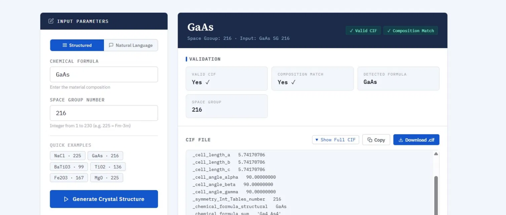
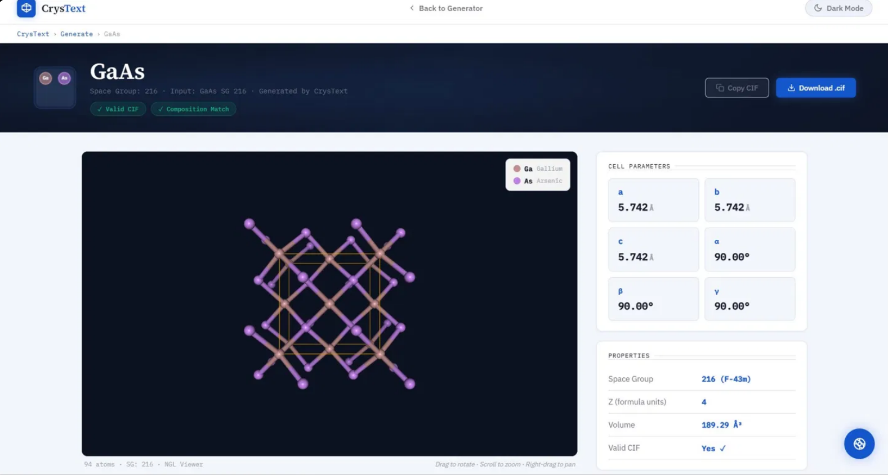

# CrysText — Text-Conditioned Crystal Structure Generation

Generate valid crystal structure CIF files from a material formula and space group number using a fine-tuned large language model — rendered live as an interactive 3D structure.

> **Type a formula. Get a crystal structure.**

Selected for **KMIT Expo** (Group G-1225) · Built by a team of 5 under the mentorship of **Dr. Ashok Sharma**

---

## What It Does

Type a formula like `NaCl` and space group `225` → CrysText generates a complete Crystallographic Information File (CIF) with cell parameters, atom positions, and symmetry information, then renders it as an interactive 3D ball-and-stick structure in the browser — no domain software required.

Natural language input is also supported (e.g. *"generate a rock salt structure for sodium chloride"*), with a formula/space-group parser extracting the structured inputs automatically.






---

---

---

## Why This Matters

A paper independently introducing the same core methodology — Mistral-7B/LLaMA-3.1-8B, QLoRA fine-tuning, MP-20 dataset, GRPO reward shaping — was published by researchers at the University of Utah:

> Mohanty, T., Mehta, M., Sayeed, H.M. et al. **"CrysText: A Generative AI Approach for Text-Conditioned Crystal Structure Generation Using LLM."** *Integrating Materials and Manufacturing Innovation* (2026). https://doi.org/10.1007/s40192-026-00451-8 — [preprint (ChemRxiv)](https://chemrxiv.org/engage/chemrxiv/article-details/6902b85bef936fb4a21c992a)

Their results validate the underlying approach. This project was developed independently and adds, on top of the validated method:
- A full deployable web app (Flask backend + browser frontend)
- Interactive 3D structure rendering (NGL Viewer)
- Confidence scoring per generation
- Natural-language input mode
- An integrated chatbot for structure Q&A

**The paper proves the science. This is the product.**

---

## Results (n=10 evaluation set)

| Metric | Score |
|---|---|
| CIF Parse Rate | 100% |
| Composition Accuracy | 100% |
| Space Group Accuracy | 60% |
| Structure Match Rate | 40% |
| F1 Score (Space Group) | 0.75 |
| Train / Val / Test Loss | 0.193 / 0.199 / 0.188 |
| Train–Test Gap | 0.005 → well-fitted, no overfitting |

Best model: [`vaishna28/shuffle_20k`](https://huggingface.co/vaishna28/shuffle_20k) — fine-tuned on a shuffled 20k-sample subset of the ~45K-structure MP-20 dataset, Epoch 2.

---

## Model & Training

- **Base model:** Mistral-7B-v0.3 (outperforms LLaMA-2-13B on relevant benchmarks)
- **Fine-tuning:** Supervised Fine-Tuning via QLoRA — rank=16, lora_alpha=16, 4-bit quantization (~42M trainable parameters)
- **Target layers:** `q_proj`, `k_proj`, `v_proj`, `o_proj` (attention layers)
- **Dataset:** [MP-20](https://materialsproject.org) — ~45,000 experimentally verified inorganic crystal structures; trained on a curated 27,136-structure subset
- **Training format:** Alpaca instruction template (instruction → input → CIF response)
- **Training stack:** Unsloth + HuggingFace TRL's `SFTTrainer`, on a Kaggle T4 GPU
- **Inference:** RTX 5050 Laptop GPU (8.5GB VRAM), ~2–3 min per generation

### Reward Function

Used for candidate scoring and as the basis for planned GRPO fine-tuning:

| Criterion | Points |
|---|---|
| Valid CIF Parse | 0.10 |
| Physical Validity (no atom overlap, valid volume) | 0.20 |
| Composition Match | 0.20 |
| Structure Similarity (StructureMatcher) | 0.50 |

### GRPO Status

- Reward function: ✅ written (`crystext_rewards.py`)
- Training script: ✅ written (`grpo_train.py`, num_generations=6)
- Actually trained: ❌ **not yet** — requires 24GB VRAM
- Expected impact: space group accuracy 60% → ~99%

---

## Architecture


---

## Pipeline

1. **User Input** — formula + space group, via structured form or natural language
2. **Prompt Refinement** — normalize formula (`nacl` → `NaCl`), wrap in Alpaca template
3. **Mistral-7B + QLoRA** — autoregressive CIF generation, token by token
4. **Pymatgen Validation** — parse CIF, verify composition, detect space group
5. **Reward Scoring** — confidence score (0–100%) combining parse/composition/space-group/reward checks
6. **NGL Viewer** — interactive 3D rendering with atom colors and cell parameters

---

## Demo Compounds

| Formula | Space Group | Structure Type | Status |
|---|---|---|---|
| NaCl | 225 | Rock salt (cubic) | ✅ Works |
| GaAs | 216 | Zinc blende | ✅ Works (94 atoms in NGL) |
| MgO | 225 | Rock salt (cubic) | ✅ Works |
| Au | 225 | FCC metal | ✅ Works |
| LiCoO₂ | 166 | Layered oxide | ✅ Works — real EV battery cathode |
| TiO₂ | 136 | Rutile | ✅ Works |
| Fe₂O₃ | 167 | Hematite | ✅ Works |
| Si | 227 | Diamond cubic | ✅ Works |
| BaTiO₃ | 99 | Perovskite | ⚠️ Generates as SG 221 |
| GaN | 186 | Hexagonal wurtzite | ❌ Model struggles (hexagonal underrepresented in MP-20) |

---

## Tech Stack

**Backend:** Flask (port 5000), PyTorch, `transformers`, `peft`, `bitsandbytes`, `pymatgen`
**Frontend:** HTML/CSS/JavaScript, [NGL Viewer](https://nglviewer.org/) (WebGL 3D ball-and-stick)
**Chatbot:** Groq (Llama 3.3 70B) primary, Gemini 2.5 Flash fallback
**Training:** Kaggle T4 GPU, Unsloth, TRL, SFTTrainer

---

## Requirements

- Python 3.10+
- CUDA GPU with at least 8GB VRAM
- CUDA drivers installed

## Installation

```bash
git clone https://github.com/rakshitha-dev9/Crystext.git
cd Crystext
pip install -r requirements.txt
```

## Running the App

You need two terminals open at the same time.

**Terminal 1 — start the Flask backend (loads the model):**
```bash
python app.py
```
Wait for:
```
✅ CrysText is ready! Server starting on http://localhost:5000
```
This takes 10–15 minutes on first run while the model downloads and loads.

**Terminal 2 — start the frontend:**
```bash
python -m http.server 8080
```

**Then open:** `http://localhost:8080/index.html`

---

## Project Structure

```
Crystext/
├── app.py                     ← Flask backend (port 5000)
├── index.html                 ← Main UI
├── structure.html             ← NGL 3D viewer
├── prompt_refinement.py
├── llm_prompt_refiner.py
├── requirements.txt
├── README.md
└── training/
    ├── crystext_training.ipynb
    ├── grpo_train.py
    ├── crystext_rewards.py    ← imported by app.py
    ├── crystext_grpo_reward.py
    ├── dataset_utils.py
    ├── prepare_grpo_dataset.py
    └── __init__.py
```

---

## Known Limitations & Future Work

- Space group accuracy currently 60% — GRPO training (code ready, needs 24GB VRAM hardware) is expected to raise this significantly
- Hexagonal structures (e.g. SG 186, 194) underperform — underrepresented in the MP-20 training set
- API keys (Groq/Gemini) currently live in frontend HTML — move to environment variables before any public deployment
- Planned: deployment on HuggingFace Spaces (ZeroGPU) for public access
- Potential submission target: *npj Computational Materials* or *Digital Discovery*

---

## Team

Built by a team of 5 — Rakshitha (backend/model integration), Charanya, Vaishnavi, Arnamsh, Himanesh — as part of an AI + Materials Science project at KMIT.
Mentored by **Dr. Ashok Sharma**. Training on Kaggle T4 GPU; inference validated locally on RTX 5050.
